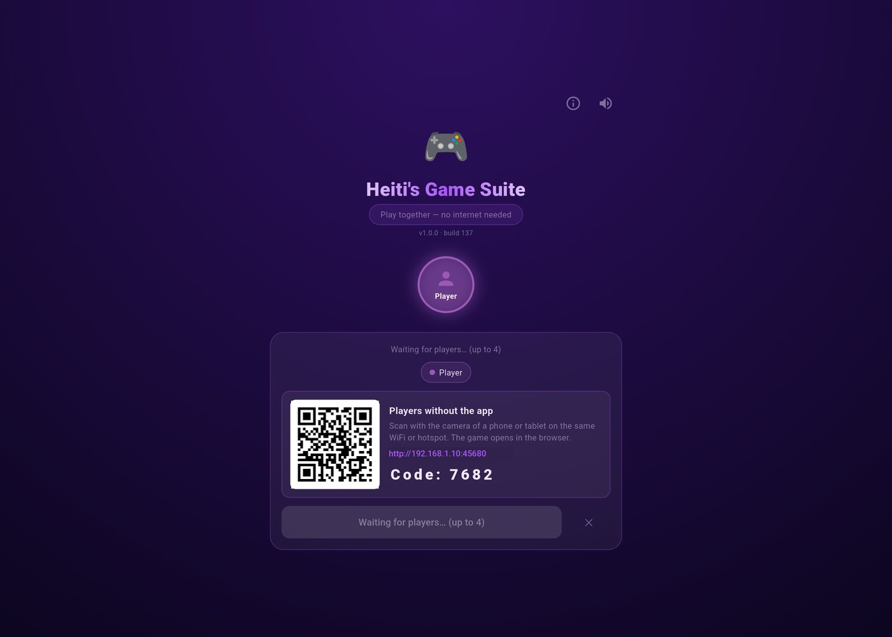
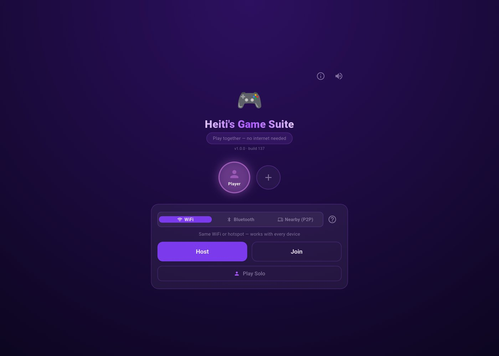
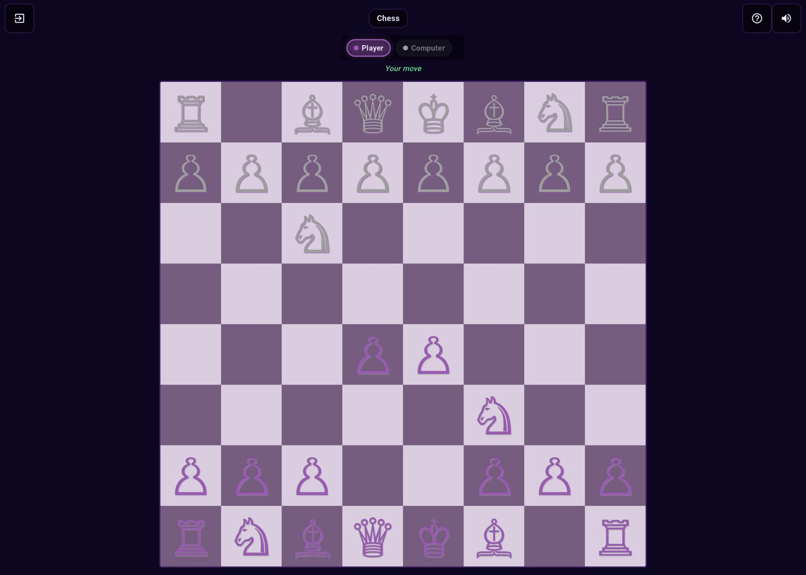
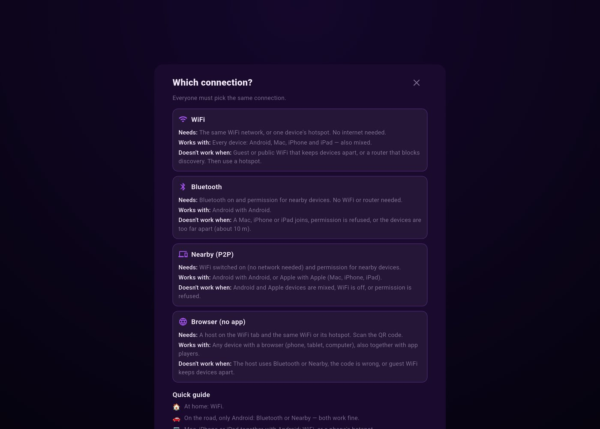
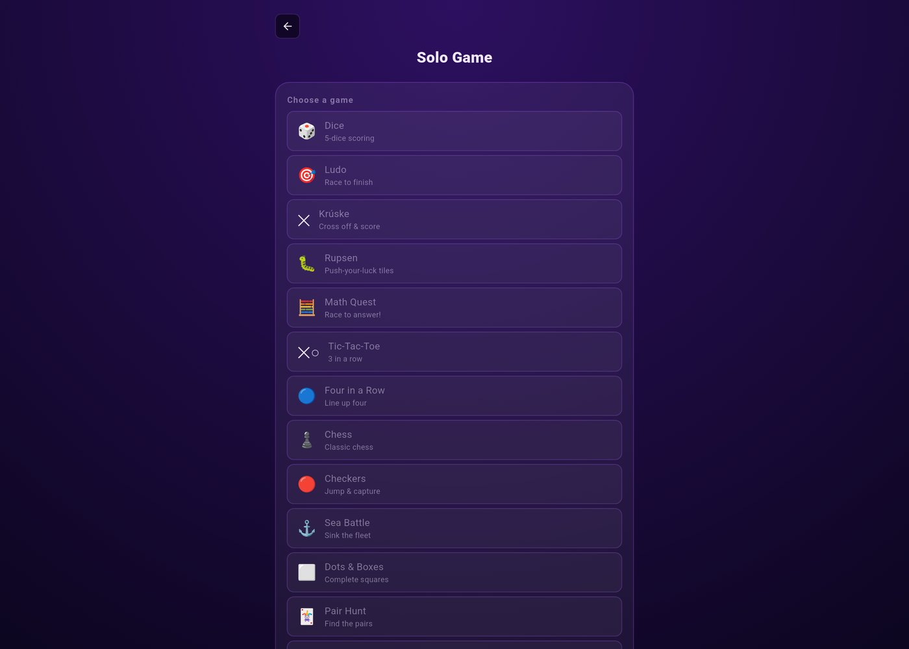

# Heiti's Game Suite

**29 games to play together — anywhere, no internet needed.**
A family game suite for Android tablets and phones (also builds for macOS and iOS), in Frisian, Dutch and English.

In the car, on the camp site, in a holiday cottage or on a plane in flight mode: the devices connect **directly to each other** over Bluetooth, a direct WiFi link or a phone's hotspot. No mobile data, no WiFi router, no account. Play solo against the computer, or let friends **without the app** join from their phone's browser.



## Made for places without internet

- 🚗 **In the car:** two or more Android devices play over Bluetooth or Nearby — no network at all.
- ⛺ **On the camp site or in a holiday cottage:** one phone turns on its hotspot and everyone joins it. The hotspot doesn't need mobile data; it only links the devices.
- ✈️ **On a plane or a ferry:** flight mode is fine, as long as Bluetooth or WiFi is switched back on.
- 🔒 **Nothing goes online:** no account, no sign-up, no data leaves your devices. Everything, including the browser version for friends without the app, is served by the host device itself.

## Screenshots

| Start screen | Chess against the computer |
|---|---|
|  |  |
| **Which connection? (in-app help)** | **Solo: pick a game** |
|  |  |

## Features

- **29 games** — board, card, dice, word, drawing and action games (see below)
- **Offline multiplayer** for 2–4 players — works without internet: WiFi (same network or a hotspot), Bluetooth, or Nearby (WiFi Direct)
- **Hosted mode** — friends without the app scan a QR code and play in their browser, together with app players
- **Solo mode** against the computer (easy / medium / hard)
- **Tournaments**, chat, player profiles with avatars, and win/loss statistics
- **Three languages:** Frysk, Nederlands, English

## Games

| | | | |
|---|---|---|---|
| 🎲 Dice | 🎯 Ludo | ✕ Krúske | 🐛 Rupsen |
| 🧮 Math Quest | ✕○ Tic-Tac-Toe | 🔵 Four in a Row | ♟ Chess |
| 🔴 Checkers | ⚓ Sea Battle | ⬜ Dots & Boxes | 🃏 Pair Hunt |
| 🏓 Paddle Duel | 🔴 Color Echo | 🔢 Sudoku Duel | 🔤 Word Scramble |
| 🧩 Sliding Puzzle | 🐍 Snake | 🎨 Draw & Guess | 🥚 Aaisykje |
| 🁣 Dominoes | 🕵️ Who Are You? | 🃏 Klaverjassen | 🔍 Word Search |
| 🃏 Solitaire | 🏒 Air Hockey | 🂡 Thirty-One | 👆 Tap Frenzy |
| 🖌 Quick Draw | | | |

## Download (Android)

Get the latest APK from the [Releases](../../releases) page and open it on your Android device.
The first time, Android asks to allow installing apps from your browser or file manager — that's normal for apps outside the Play Store. Google Play Protect may offer to scan the app; choose *Install anyway*.

## How to play together

Everyone picks the **same connection** on the start screen (tap **?** there for this guide in the app).

| | **WiFi** | **Bluetooth** | **Nearby (P2P)** | **Browser (no app)** |
|---|---|---|---|---|
| Needs | same WiFi, or one device's hotspot | Bluetooth on | WiFi switched on | a host on the WiFi tab + scan its QR code |
| Android ↔ Android | ✅ | ✅ | ✅ | ✅ |
| Android ↔ iPhone / iPad / Mac | ✅ | ❌ | ❌ | ✅ (in the browser) |
| Internet needed | no | no | no | no |

- 🏠 **At home:** WiFi
- 🚗 **On the road, only Android:** Bluetooth or Nearby — both work fine
- 🌐 **Friends without the app:** host on WiFi, they scan the QR code (it contains the 4-digit join code)

Then one device taps **Host**, the others tap **Join** and find the host automatically. The host picks a game and taps **Start**.

## Building from source

Requirements: [Flutter 3.27](https://docs.flutter.dev/get-started/install), Android SDK, and Python 3 (used once to trim the emoji font for the browser version). For macOS/iOS: Xcode and CocoaPods.

```bash
flutter pub get
./build.sh          # Android APK → build/app/outputs/flutter-apk/app-release.apk
./build-macos.sh    # macOS app
./build-ios.sh      # iOS
```

The build scripts first package the browser version of the app (`tool/build_webclient.sh`), which the host device serves to browser players.

Release APKs are signed with the key configured in `android/key.properties` (not included in this repository); without it the build falls back to your local debug key.

## License

Heiti's Game Suite is released under the [MIT License](LICENSE), © 2026 [iappyx](https://iappyx.github.io/).

It bundles some third-party material; see [NOTICE](NOTICE):

- **Emoji font** — [Noto Color Emoji](https://github.com/googlefonts/noto-emoji), © Google LLC, SIL Open Font License 1.1 (`assets/fonts/OFL.txt`). The app icon is rendered with one of its emoji.
- **Roboto** (font of the browser version) — © Google, Apache License 2.0 (`assets/fonts/roboto/LICENSE.txt`).
- **Sound effects** — from [Kenney](https://kenney.nl) (Interface Sounds, Digital Audio, Casino Audio), public domain (CC0). Credited with thanks.
- **Flutter and Dart packages** — used under their own licenses (BSD, MIT, Apache-2.0); the app lists them under *About → All licenses*.

## Support

If you find Heiti's Game Suite useful, consider [buying me a coffee](https://ko-fi.com/iappyx).
